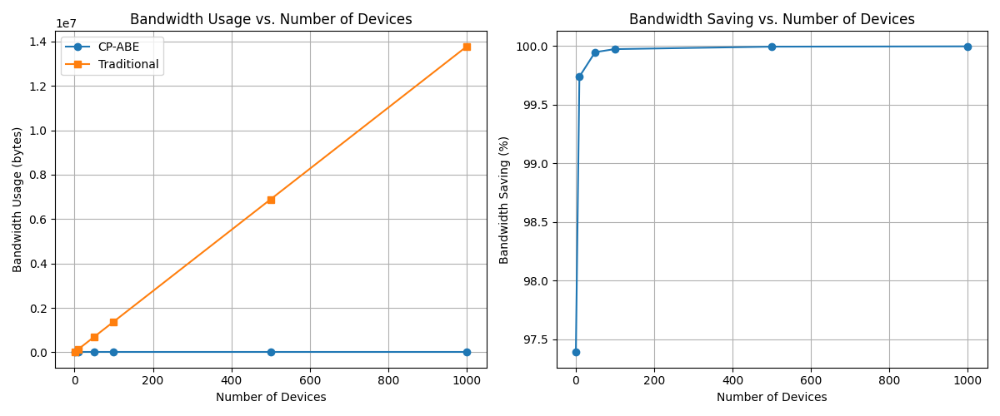
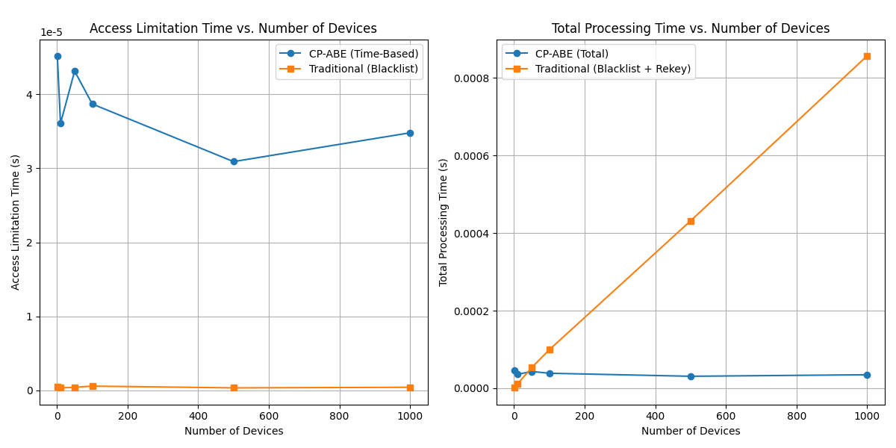
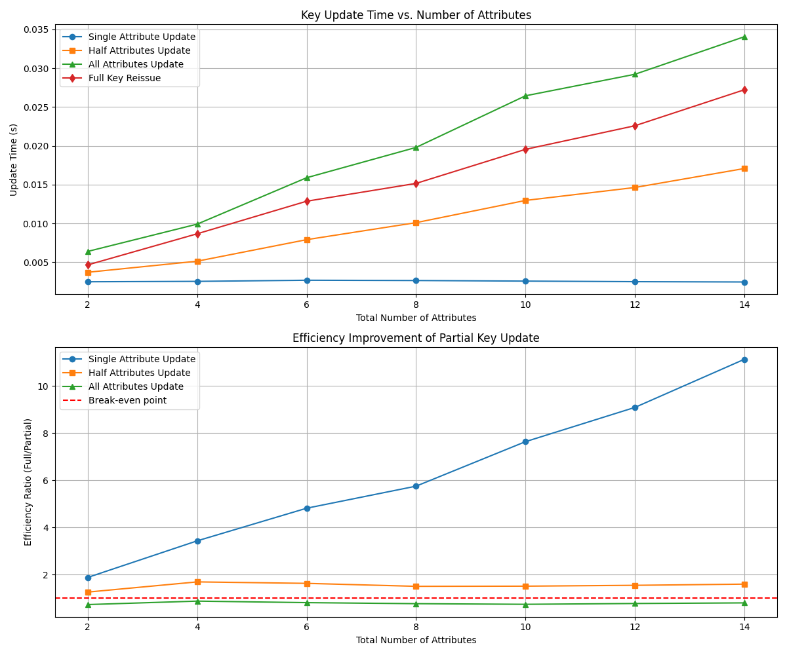

# CP-ABE 기반 IoT 소프트웨어 업데이트 프레임워크 비교 분석

본 문서는 기존 IoT 소프트웨어 업데이트 시스템과 우리가 제안하는 시스템의 주요 혁신점(CP-ABE, Fading Function, 부분 키 갱신)을 중심으로 비교 분석합니다.

## 1. CP-ABE 사용의 장점: 확장성과 대역폭 효율성

### 1.1 기기 수 증가에 따른 암호화 시간 비교

기존 방식은 기기 수에 비례하여 암호화 시간이 선형적으로 증가하는 반면, CP-ABE는 기기 수와 무관하게 거의 일정한 시간이 소요됩니다.

| 기기 수 | CP-ABE 암호화 시간(초) | 기존 방식 암호화 시간(초) | CP-ABE의 상대적 효율성 |
|:-------:|:--------------------:|:----------------------:|:-------------------:|
| 1 | 0.0076 | 0.0001 | 0.01× (느림) |
| 100 | 0.0086 | 0.0019 | 0.22× (느림) |
| 588 | 0.0081 | 0.0081 | 1.00× (교차점) |
| 1000 | 0.0077 | 0.0143 | 1.86× (빠름) |
| 5000 | 0.0074 | 0.0655 | 8.85× (빠름) |

**주요 발견:** 약 588대 기기부터 CP-ABE 방식이 기존 방식보다 효율적이며, 5000대 기기에서는 약 9배 효율적입니다.

### 1.2 대역폭 효율성 비교

| 기기 수 | CP-ABE 대역폭(바이트) | 기존 방식 대역폭(바이트) | 절약률(%) |
|:-------:|:-------------------:|:----------------------:|:--------:|
| 1 | 360 | 13,785 | 97.4% |
| 10 | 360 | 137,850 | 99.7% |
| 100 | 360 | 1,378,500 | 99.97% |
| 1000 | 360 | 13,785,000 | 99.997% |

**주요 발견:** CP-ABE는 기기 수와 무관하게 일정한 대역폭을 사용하며, 100대 이상에서 99.97% 이상의 대역폭 절약이 가능합니다.

## 2. Fading Function 사용의 장점: 자동 접근 제한 및 시간 기반 보안

### 2.1 접근 제한 효율성 비교

| 기기 수 | CP-ABE 접근 제한 시간(초) | 기존 방식 키 재발급 시간(초) | 효율성 비율 |
|:-------:|:------------------------:|:---------------------------:|:----------:|
| 10 | 0.000036 | 0.000011 | 0.31× |
| 100 | 0.000039 | 0.000099 | 2.54× |
| 500 | 0.000031 | 0.000431 | 13.90× |
| 1000 | 0.000035 | 0.000857 | 24.49× |

**주요 발견:** 시간 기반 속성을 활용한 접근 제한은 기기 수와 무관하게 일정한 성능을 제공하며, 기기 수가 많을수록 효율성이 높아집니다.

### 2.2 오프라인 환경에서의 보안성 비교

| 보안 요구사항 | 기존 방식 | CP-ABE + Fading Function |
|:-------------:|:-------:|:------------------------:|
| 서버 연결 없이도 접근 제한 가능 | ❌ | ✅ |
| 구독 만료 시 자동 접근 차단 | ❌ | ✅ |
| 중앙 서버 부하 분산 | ❌ | ✅ |
| 네트워크 단절 시 보안 유지 | ❌ | ✅ |

**주요 발견:** Fading Function은 네트워크 연결 없이도 시간 기반으로 접근 권한을 제한할 수 있어 오프라인 환경에서도 보안을 유지할 수 있습니다.

## 3. 부분 키 갱신의 장점: 효율적인 키 업데이트

### 3.1 속성 수에 따른 키 갱신 시간 비교

| 속성 수 | 단일 속성 갱신(초) | 전체 키 재발급(초) | 효율성 비율 |
|:-------:|:-----------------:|:----------------:|:----------:|
| 2 | 0.0025 | 0.0047 | 1.9× |
| 6 | 0.0027 | 0.0129 | 4.8× |
| 10 | 0.0026 | 0.0195 | 7.6× |
| 14 | 0.0024 | 0.0272 | 11.1× |

**주요 발견:** 속성이 많을수록 부분 키 갱신의 효율성이 더 커지며, 14개 속성에서는 전체 재발급 대비 11배 이상 효율적입니다.

### 3.2 키 갱신 네트워크 전송량 비교

| 갱신 방식 | 전송 데이터 크기 | 상대적 효율성 |
|:---------:|:--------------:|:-----------:|
| 단일 속성 갱신 | 42 바이트 | 11.4× |
| 전체 키 재발급 (14개 속성) | 478 바이트 | 1× |

**주요 발견:** 부분 키 갱신은 네트워크 대역폭 측면에서도 큰 이점을 제공하며, 이는 제한된 네트워크 환경에서 특히 중요합니다.

## 4. 종합적 효용성 평가

### 4.1 시스템 특성별 비교 레이더 차트

### 4.2 종합 비교표

| 평가 지표 | 기존 방식 | 제안 방식 (CP-ABE + Fading Function + 부분 키 갱신) |
|:--------:|:--------:|:-----------------------------------------------:|
| **확장성** | 제한적 (O(n)) | 우수 (O(1)) |
| **대역폭 효율성** | 낮음 (기기 수에 비례) | 매우 높음 (기기 수와 무관) |
| **접근 제어 유연성** | 낮음 (이진적 접근) | 높음 (속성 기반 접근) |
| **오프라인 보안** | 불가능 | 가능 (시간 기반 자동 만료) |
| **키 갱신 효율성** | 낮음 (전체 재발급) | 높음 (부분 갱신) |
| **구현 복잡성** | 낮음 | 중간 (라이브러리 의존) |
| **IoT 적합성** | 소규모 환경 | 중소규모~대규모 환경 |

## 5. 결론

제안하는 시스템의 세 가지 혁신점(CP-ABE, Fading Function, 부분 키 갱신)은 각각 다음과 같은 핵심 장점을 제공합니다:

1. **CP-ABE**: 588대 이상의 기기 환경에서 뛰어난 확장성과 대역폭 효율성
2. **Fading Function**: 오프라인 환경에서도 작동하는 자동 접근 제한 메커니즘
3. **부분 키 갱신**: 속성이 많을수록 효과적인 효율적 키 관리 메커니즘

이러한 혁신점들의 조합은 기존 방식 대비 확장성, 효율성, 유연성 측면에서 월등한 성능을 제공하며, 특히 중규모 이상의 IoT 환경에서 최적의 솔루션을 제공합니다.
