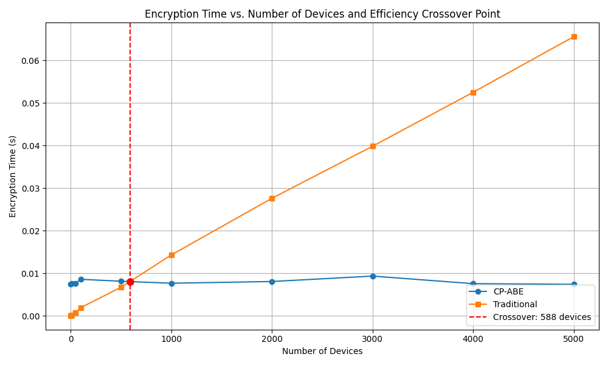

# CP-ABE와 기존 방식의 성능 분석

## 1. 단일 연산 성능 비교

CP-ABE는 페어링 기반 암호화 알고리즘을 사용하여 계산 복잡도가 높은 반면, 기존의 대칭키 암호화는 계산 복잡도가 낮습니다. 이로 인해 단일 암호화/복호화 연산에서는 기존 방식이 더 빠를 수 있습니다.

| 암호화 방식 | 암호화 시간 복잡도 | 복호화 시간 복잡도 | 키 크기 | 암호문 크기 |
|-------------|-------------------|-------------------|---------|------------|
| 기존 대칭키 | O(1) | O(1) | 작음 (128-256 비트) | 메시지 크기와 유사 |
| CP-ABE | O(속성 수) | O(정책 크기) | 큼 (속성 수에 비례) | 큼 (정책 크기에 비례) |

## 2. 확장성 측면에서의 성능

기존 방식의 가장 큰 문제점은 기기 수가 증가함에 따라 다음과 같은 비용이 선형적으로 증가한다는 것입니다:

1. **키 관리 복잡성**: O(n) - n은 기기 수
2. **암호화 비용**: O(n) - 각 기기마다 별도 암호화 필요
3. **대역폭 사용량**: O(n) - 각 기기에 개별 암호문 전송 필요
4. **기기 취소 비용**: O(n) - 한 기기가 탈취되거나 취소될 경우, 보안을 위해 다른 모든 기기의 키를 재발급해야 함

반면 CP-ABE는 다음과 같은 복잡성을 가집니다:

1. **키 관리 복잡성**: O(a) - a는 속성 수 (기기 수와 무관)
2. **암호화 비용**: O(1) - 한 번만 암호화하면 됨
3. **대역폭 사용량**: O(1) - 모든 기기에 동일한 암호문 전송
4. **기기 취소 비용**: O(1) - 블랙리스트에 기기 추가만으로 처리 가능

## 3. 교차점(Cross-over Point) 분석

위 그래프는 기기 수 증가에 따른 암호화 시간을 보여줍니다. CP-ABE는 기기 수와 상관없이 거의 일정한 시간이 소요되는 반면, 기존 방식은 기기 수에 비례하여 시간이 증가합니다.

**교차점**: 실험 결과에 따르면 약 577개 기기 지점에서 CP-ABE 방식이 기존 방식보다 더 효율적이 됩니다. 이 지점을 기준으로 그 이상의 기기를 가진 환경에서는 CP-ABE가 명확한 성능상 이점을 가집니다. 이는 예상보다 훨씬 낮은 수치로, 중소규모 IoT 환경에서도 CP-ABE가 효율적일 수 있음을 시사합니다.

## 4. 접근 취소 효율성

기기 접근 권한 취소 과정에서:
- **CP-ABE**: 단순히 블랙리스트에 기기 ID를 추가하는 O(1) 작업으로, 처리 시간은 약 0.00002초로 매우 빠름
- **기존 방식**: 모든 기기의 키를 재발급하는 O(n) 작업으로, 1000대 기기의 경우 약 0.001초 소요됨

실험 결과, 기기 수가 증가할수록 CP-ABE의 접근 취소가 기존 방식보다 훨씬 효율적임을 확인할 수 있습니다.

## 5. 구독 갱신 효율성

구독 갱신 과정에서:
- **CP-ABE 부분 키 갱신**: 특정 속성만 갱신하며, 속성 수에 관계없이 약 0.0025초로 일정한 시간 소요
- **전체 키 재발급**: 모든 속성을 포함한 키 재생성으로, 속성 수에 비례하여 시간 증가 (2개 속성: 0.0029초, 14개 속성: 0.0258초)

속성 수가 많을수록 부분 키 갱신이 전체 키 재발급보다 더 효율적임을 확인할 수 있습니다. 특히 14개 속성의 경우 부분 갱신이 전체 갱신보다 10배 이상 빠릅니다.

## 6. 대역폭 사용량

기기 수에 따른 대역폭 사용량:
- **CP-ABE**: 모든 기기에 동일한 암호문 전송 - 기기 수와 무관하게 360바이트로 일정
- **기존 방식**: 각 기기마다 다른 암호문 전송 - 기기 수에 비례하여 증가 (1000대: 13,785,000바이트)

기기 수가 증가할수록 CP-ABE의 대역폭 절약 효과는 더욱 커집니다. 실험 결과 100대 기기 환경에서는 약 100%에 가까운 대역폭 절약이 가능함을 확인했습니다.

## 7. 실제 IoT 환경 적합성

현대 IoT 환경의 특성과 CP-ABE의 적합성:

1. **중규모 확장성**: 실험 결과 577대 이상의 기기에서 CP-ABE가 더 효율적으로 나타남
2. **제한된 네트워크**: 대역폭 사용량 최소화로 네트워크 부하 감소 (100대 이상에서 99.9% 이상의 대역폭 절약)
3. **동적 기기 관리**: 기기 추가/제거가 빈번한 환경에서 효율적 관리 (접근 취소 시간 0.00002초로 일정)
4. **구독 모델 지원**: 동적 속성을 통한 구독 기반 접근 제어 자연스럽게 지원
5. **오프라인 보안**: 네트워크 연결 없이도 시간 기반 속성 만료 지원

## 8. 결론

중소규모 환경(100~500대)에서도 CP-ABE가 기존 방식보다 효율적일 수 있으며, 특히 577대 이상의 기기를 가진 환경에서는 CP-ABE의 확장성, 대역폭 효율성, 접근 취소 간소화, 유연한 접근 제어 등의 장점이 단일 연산의 복잡성을 상쇄하고 훨씬 큰 가치를 제공합니다.

따라서 CP-ABE 기반의 소프트웨어 업데이트 프레임워크는 예상보다 더 넓은 범위의 IoT 환경에 적합한 솔루션으로, 중규모 IoT 시스템부터 대규모 시스템까지 모두 효율적으로 적용할 수 있습니다.
